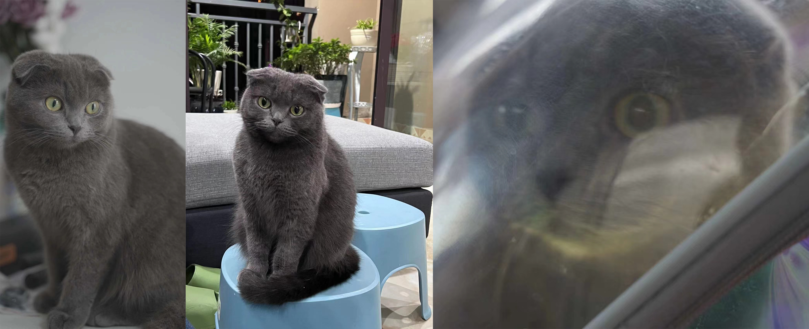

<!-- “人生是一场体验”，是我一直以来都十分相信的一句话。这激励着我对世界始终充满好奇，体验更多彩的人生，既保持对身边事物的观察也勇于去探索更广阔的未至之境。 -->

"Life is an experience" is a phrase I have always deeply believed in. It motivates me to stay curious about the world, to experience a more colorful life, maintaining an observant attitude towards the things around me while also daring to explore the broader unknown.

 

 <!-- Volunteering -->
  <h2 class="archive__item-title" itemprop="headline">Volunteering</h2>
  
  <!-- 我对志愿服务的热爱源于帮助他人带来的满足感和成就感。无论是参与校园活动、支教项目，还是在各种社区公益中提供帮助，这些经历都给我机会去深入了解一个我原本陌生的群体，让我更加理解和珍惜社会的多样性和复杂性。通过志愿服务，我不仅能够对社区做出实际贡献，还有机会结识来自不同背景的人们，这些都极大地丰富了我的人生视野。每次投身于志愿活动，我都能感受到自己的成长。-->
  
My passion for volunteering stems from the satisfaction and fulfillment that comes from helping others. Whether participating in campus events, volunteer teaching projects, or providing assistance in various community-related projects, these experiences have given me the opportunity to deeply understand groups that were once unfamiliar to me, enhancing my appreciation for the <strong>diversity and complexity of society</strong>. Through volunteering, I am able to make tangible contributions to the community and meet people from diverse backgrounds, all of which greatly enrich my perspective on life. Each time I engage in volunteer activities, I can feel my own growth.
  

 

 <!-- Technical Art/ Interaction Engineer -->
  <h2 class="archive__item-title" itemprop="headline">Photography</h2>
  
  <!-- 摄影对我来说不仅是一种爱好，更是一种探索世界和表达自我的方式。通过镜头，我能捕捉到生活中那些短暂而美好的瞬间，也会为了拍摄到更美好的景色突破自我的安逸圈。此外，我创办了自己的摄影社团，组织了一系列摄影活动，也遇到了许多真诚的朋友。同时我也有幸获得了国家地理在内的一些摄影比赛奖项。-->
  
For me, photography is not just a hobby, but also a way to explore the world and express myself. Through my lens, I capture those fleeting, beautiful moments of life, and I often step out of my comfort zone to photograph even more stunning scenes. Additionally, I founded my own photography club, organizing a series of photography events where I've met many genuine friends. I've also been fortunate to receive some awards in photography competitions, including some from <strong>National Geographic</strong>.
  

 

 <!-- Cycling and Motor Cycling -->
  <h2 class="archive__item-title" itemprop="headline">Cycling and Motor Cycling</h2>
  
  <!-- 对我而言，骑行总有着一种特殊的魔力。它给了我一种前进的感觉和在任何我想驻足的地方停留的机会。长途骑行让我能够从更大尺度上真实地感受更加广阔、多元的文化、人群、社会。18岁生日，我从重庆骑行到了昆明，19岁完成了川藏线的骑行，25岁生日骑着摩托车再度横穿了整个中国。这些经历为我提供了宝贵的精神价值。 -->
  
There is a special kind of magic in Cycling. It gives me a sense of moving forward and opportunities to stop wherever I want to linger. Long-distance cycling allows me to truly experience <strong>diverse cultures</strong>, <strong>people</strong>, and <strong>society</strong> on a larger scale and to develop a deeper understanding of the world. <li>On my 18th birthday, I cycled from Chongqing to Kunming（1100km）;</li><li>At 19, I completed the ride along the Sichuan-Tibet Highway(2400km);</li><li>On my 25th birthday, I crossed the entire China (4700km) on a motorcycle again.</li>These experiences have provided me with invaluable spiritual value.
  

 

 <!-- Bodybuilding -->
  <h2 class="archive__item-title" itemprop="headline">Exercising</h2>
  <!-- 运动消除了我的烦恼，使我的身体焕然一新，并给我勇气去应对任何挑战。我热爱健身、篮球。我非常喜欢挥洒汗水的感觉，那给我一种对于自己身体的掌控感。虽然我现在并没有大量的时间用于健身，但我仍然保持着运动的习惯。-->
  
Exercising eliminates my worries, revitalizes my body, and gives me the courage to face any challenge. I have a passion for fitness and basketball. I really enjoy the feeling of sweating it out, which gives me a sense of control over my body. Although I don't have a lot of time for fitness recently, I still maintain the habit of exercising.
  

  

 

  <h2 class="archive__item-title" itemprop="headline">My Cat</h2>
  
She's my stupid little cutie, Pipi.
  
  

