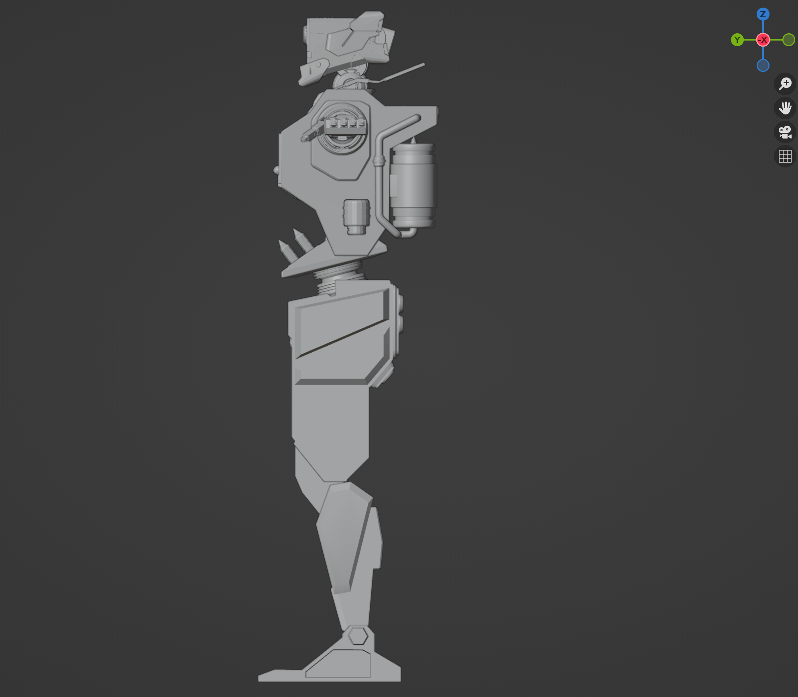
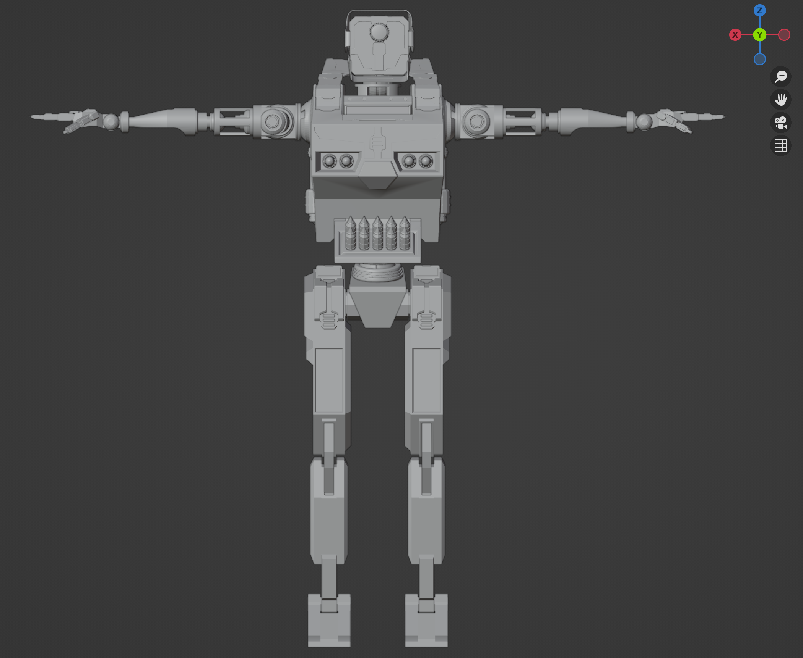

# Shader

 

 
  <h2 class="archive__item-title" itemprop="headline">Interactive Shield</h2>
    <video height="360" controls><source src="../images/others/Shield.mp4" type="video/mp4">Your browser does not support the video tag.</video>
  
 

 

 
  <h2 class="archive__item-title" itemprop="headline">Rain Scene</h2>
    <video height="360" controls><source src="../images/others/RainScene.mp4" type="video/mp4">Your browser does not support the video tag.</video>
  
 

# DCC

 

 
  <h2 class="archive__item-title" itemprop="headline">Gas Robot</h2>
  
  
  
  
  

  

 

 
  <h2 class="archive__item-title" itemprop="headline">Ball Robot</h2>
  
  
  
  
  <video height="360" controls><source src="../images/others/BallRobot/BallRobot.mp4" type="video/mp4">Your browser does not support the video tag.</video>
  

  

